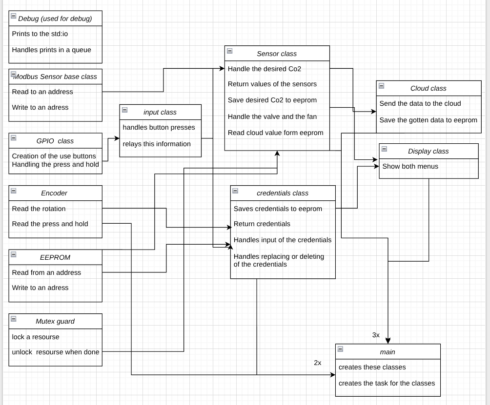

# Ventilation Control System

## Overview
A FreeRTOS-based embedded system written in C++ for monitoring temperature, humidity, and CO₂ levels.  
Developed during the third year, first period of Metropolia ICT, IoT Embedded Devices program.

The system communicates with sensors via Modbus and can send and receive data from the cloud.  
Network parameters can be configured locally.

---

## Project Goal
> The goal of the project is to implement a CO₂ fertilization controller system for a greenhouse.  
> The controller maintains the CO₂ concentration at a level set through the local and cloud interfaces.  
>  
> The controller connects to the cloud using a RESTful API and sends measured CO₂ and environmental data for display or further processing.  
> Network parameters required for connectivity are configurable via the local user interface and stored in EEPROM.

To simulate the greenhouse environment, a hardware simulator was provided to emulate real-world conditions.

---

## System Overview
The system runs on a **Raspberry Pi Pico** and performs the following functions:

- Measures **CO₂ concentration** (GMP252 sensor)
- Measures **temperature and humidity** (HMP60 sensor)
- Controls a **ventilation fan** (Produal MIO actuator)

---

## Architecture

### Task Structure

| Task Name     | Priority | Interval  | Purpose                                  |
|----------------|-----------|-----------|------------------------------------------|
| FanTask        | High      | 5 s       | Controls ventilation fan speed           |
| GmpTask        | High      | 2 s       | Reads CO₂ and temperature data           |
| HmpTask        | High      | 3 s       | Reads humidity and temperature data      |
| PressureTask   | High      | 4 s       | Reads differential pressure              |
| DebugTask      | Low       | Continuous| Handles debug message output             |

---

### Sensor Configuration

| Sensor       | Type             | Communication | Address | Parameters                     |
|---------------|------------------|----------------|----------|---------------------------------|
| GMP252        | CO₂ Sensor       | Modbus RTU     | 240      | CO₂                             |
| HMP60         | Humidity/Temp    | Modbus RTU     | 241      | Humidity, Temperature           |
| Produal MIO   | Actuator         | Modbus RTU     | 1        | Fan Control, Fan Speed          |

---

## Implementation Principles
The implementation follows the **Single Responsibility Principle (SRP)** as closely as possible.  
Each class is responsible for a specific subsystem or hardware abstraction.

Examples:
- **GPIO**, **Encoder**, and **InputManager** classes handle their respective low-level functions.
- All sensor classes inherit from a **parent base class** that provides shared logic and interfaces.

Due to time constraints and workload, strict SRP adherence was not fully achieved in later stages, but the structure remains modular and maintainable.

---

## Class Diagram

---

# Ventilation Control System

## Overview
A FreeRTOS-based embedded system written in C++ for monitoring temperature, humidity, and CO₂ levels.  
Developed during the third year, first period of the **Metropolia ICT – IoT Embedded Devices** program.

The system communicates with sensors via **Modbus** and can send and receive data from a **cloud service**.  
Network parameters are configurable locally and stored in EEPROM.

---

## Project Goal
The goal of the project is to implement a **CO₂ fertilization controller** for a greenhouse.  
The controller maintains CO₂ concentration at a target value set through both local and cloud interfaces.

The controller connects to the cloud using a **RESTful API** and transmits measured CO₂ and environmental data  
for visualization or further processing. All network parameters are settable locally and saved in non-volatile memory.

A **greenhouse simulator** device was used to replicate realistic environmental conditions during testing.

---

## System Overview
This system runs on a **Raspberry Pi Pico** and performs the following operations:

- Measures CO₂ concentration (GMP252 sensor)  
- Measures temperature and humidity (HMP60 sensor)  
- Controls ventilation fan speed (Produal MIO actuator)

---

## Architecture

### Task Structure

| Task Name   | Priority | Interval  | Purpose |
|--------------|-----------|-----------|----------|
| FanTask      | High      | 5 s       | Controls ventilation fan speed |
| GmpTask      | High      | 2 s       | Reads CO₂ and temperature data |
| HmpTask      | High      | 3 s       | Reads humidity and temperature |
| PressureTask | High      | 4 s       | Reads differential pressure |
| DebugTask    | Low       | Continuous | Handles debug message output |

> Note: The watchdog task was removed in the current implementation.

---

### Sensor Configuration

| Sensor       | Type             | Communication | Address | Parameters |
|---------------|------------------|----------------|----------|-------------|
| GMP252        | CO₂ Sensor       | Modbus RTU     | 240      | CO₂, Temperature |
| HMP60         | Humidity/Temp    | Modbus RTU     | 241      | Humidity, Temperature |
| SDP610        | Pressure Sensor  | I²C            | 0x40     | Differential Pressure |
| Produal MIO   | Actuator         | Modbus RTU     | 1        | Fan Control |

---

## Hardware Setup

### Pin Configuration
- **UART0:** Modbus communication (TX: GP0, RX: GP1)  
- **I²C:** Pressure sensor (SDA/SCL using Pico default pins)  
- **GPIOs:** Used for actuator control and local interface  

---

## Implementation Principles
The implementation follows the **Single Responsibility Principle (SRP)** wherever possible —  
each class handles one clear function or subsystem.

Examples:
- **GPIO**, **Encoder**, and **InputManager** handle low-level input/output logic.  
- All sensor classes inherit from a **base sensor class** that defines shared behavior and communication.

Although complete SRP adherence was not achieved near the project’s end due to time constraints,  
the design remains modular and maintainable.

---

## Class Diagram

---

## Documentation
The project includes:
- Class diagrams  
- Block diagrams  
- Flow charts  
- Detailed implementation principles  

---

### Notes for Doxygen Users
If Doxygen is used to generate documentation:
- You can set this file as the main page by adding to `Doxyfile`:
