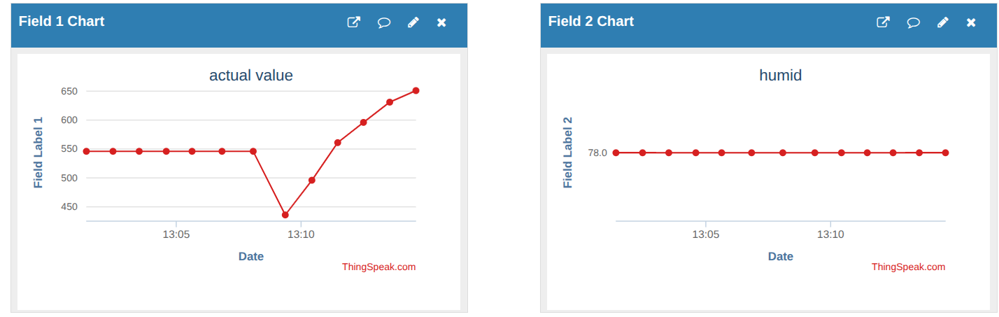
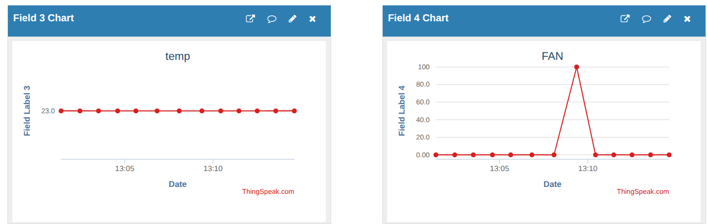
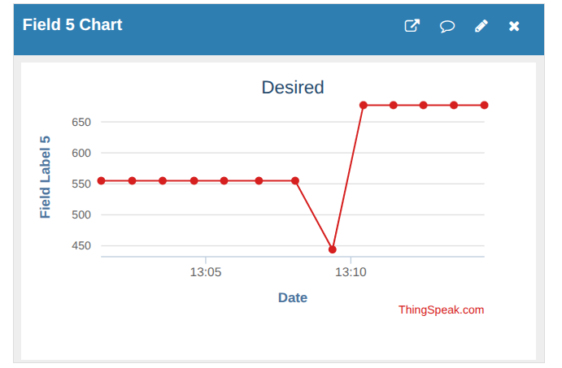
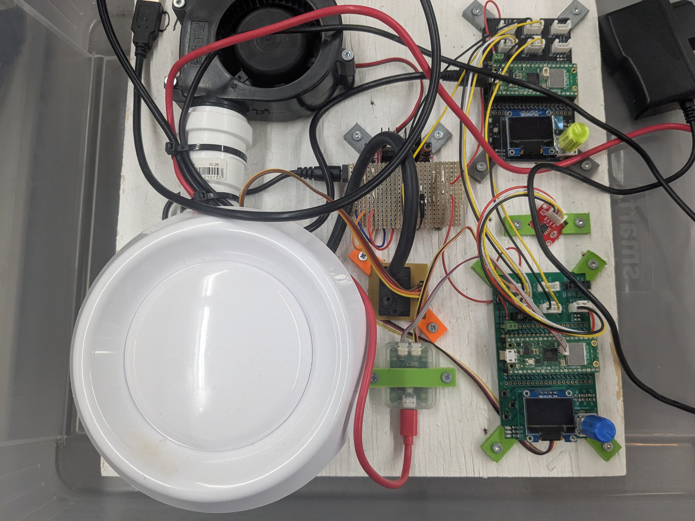
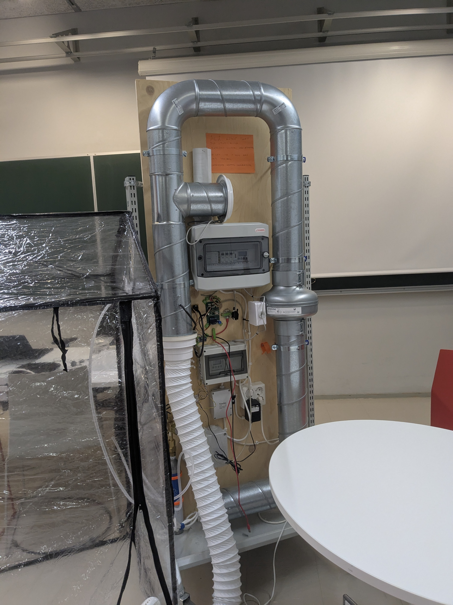
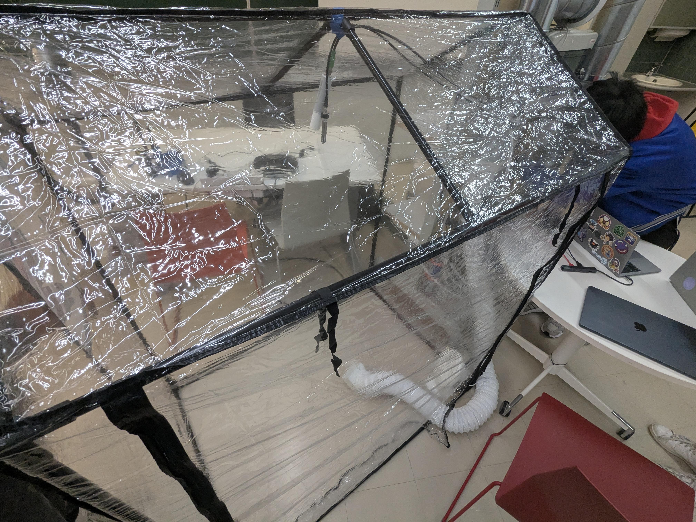

# Ventilation Control System  
> A FreeRTOS-based CO₂ Fertilization Controller for Smart Greenhouses  
> **Author**: Nischal Gautam | **Platform**: Raspberry Pi Pico (RP2040) | **Language**: C++ 

## Overview
A FreeRTOS-based embedded system written in C++ for monitoring temperature, humidity, and CO₂ levels.
Developed during the third year, first period of the **Metropolia ICT – IoT Embedded Devices** program.

The system communicates with sensors via **Modbus** and can send and receive data from a **cloud service**.
Network parameters are configurable locally and stored in EEPROM.

---

## Documentation
The project includes:
- Class diagram
- Implementation principles

---

## Project Goal
The goal of the project is to implement a **CO₂ fertilization controller** for a greenhouse.
The controller maintains CO₂ concentration at a target value set through both local and cloud interfaces.

The controller connects to the cloud using a **RESTful API** and transmits measured CO₂ and environmental data
for visualization or further processing. All network parameters are settable locally and saved in non-volatile memory.

A **greenhouse simulator** device was used to replicate realistic environmental conditions during testing.

---

## User Navigation

- **Button 7** toggles between the Wi-Fi menu and the main display.
- **Button 6** is useful when inside the Wi-Fi menu section. There you can choose which field to edit.
- **Button 9** cycles through character sets (capital letters, lowercase letters, numbers, and special characters) for text input.

Pressing the encoder confirms the current character. To reset the characters, filling the current field will reset field.
If you want to adjust the desired CO₂ setpoint, you can do so from the main menu by rotating the encoder.

### Remote Adjustment
The device can be adjusted remotely using a curl command:
`curl -v -d "command_string=SETPOINT=677&api_key=12345678910ABCDZ" http://api.thingspeak.com/talkbacks/11111/commands`

This command would set the value to 677, provided the device has a viable SSID and the correct password.
This value can, of course, be overwritten locally by rotating the encoder.

You can then remotely view the values in the cloud by logging into ThingSpeak.

---

## Cloud Environment Preview

---
More data can be sent to the cloud if the need would arise.

## The Simulated Environment, Test Device & Class diagram

## Class Diagram

## Test Kit
This is the kit we used to demo our project. It was shown initially without the clear plastic part, which was added for the final demonstration.

In this kit, the sensors are reading real data and are not simulated.

### Demo Environment

---

## System Overview
The system runs on a **Raspberry Pi Pico** and performs the following functions:

- Measures **CO₂ concentration** (GMP252 sensor)
- Measures **temperature and humidity** (HMP60 sensor)
- Controls a **ventilation fan** (Produal MIO actuator)
- Sends the values to the display and to the cloud at regular intervals. 
- Handles the button presses encoder presses along the encoder rotation. 
- Saves ssid to the EEPROM along with the last desired C02 value set by the user. 

---

## Implementation Principles
The implementation follows the **Single Responsibility Principle (SRP)** as closely as possible.
Each class is responsible for a specific subsystem or hardware abstraction.

**Examples:**
- **GPIO**, **Encoder**, and **InputManager** classes handle their respective low-level functions.
- All sensor classes inherit from a **parent base class** that provides shared logic and interfaces.

Due to time constraints and working alone on the project, strict SRP adherence is not to the level I would have liked, but the structure remains modular and maintainable.
